# Engram Architecture

A bitemporal, graph-backed intelligent agent memory system.

## System Overview

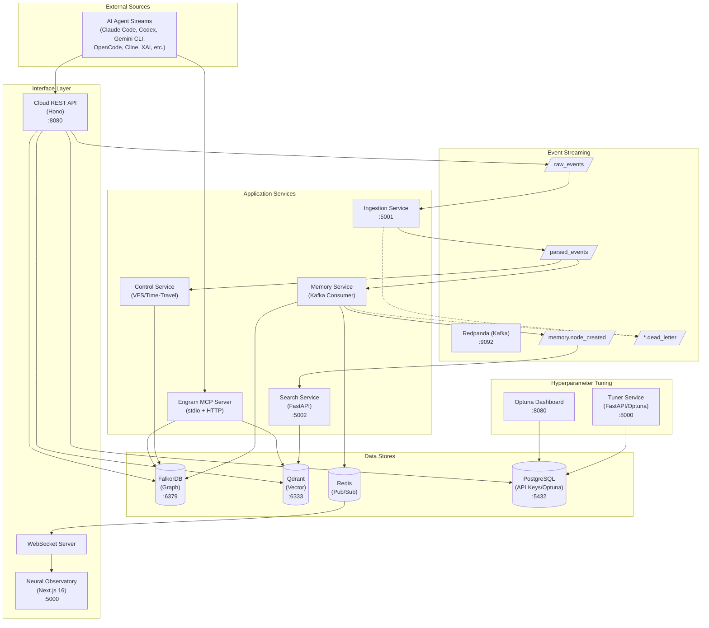

## Data Flow Pipeline

```mermaid
flowchart LR
    subgraph Capture["1. Capture"]
        Stream["Agent Stream"]
        Raw["Raw Event"]
    end

    subgraph Parse["2. Parse"]
        Registry["Provider Registry"]
        Extract["Content Extraction"]
        Thinking["Thinking Extraction"]
        Diff["Diff Extraction"]
        Redact["PII Redaction"]
    end

    subgraph Store["3. Store"]
        Aggregate["Turn Aggregation"]
        Graph["Graph Persistence"]
        Temporal["Bitemporal Tracking"]
    end

    subgraph Index["4. Index"]
        Classify["Type Classification"]
        Embed["Multi-Vector Embedding"]
        Vector["Vector Storage"]
    end

    subgraph Retrieve["5. Retrieve"]
        MultiQuery["Multi-Query Expansion"]
        Hybrid["Hybrid Search"]
        Fusion["Learned RRF Fusion"]
        Rerank["Tiered Reranking"]
        Abstention["Abstention Detection"]
        Return["Results"]
    end

    Stream --> Raw --> Registry --> Extract --> Thinking --> Diff --> Redact
    Redact --> Aggregate --> Graph --> Temporal
    Temporal --> Classify --> Embed --> Vector
    Vector --> MultiQuery --> Hybrid --> Fusion --> Rerank --> Abstention --> Return
```

## Graph Data Model

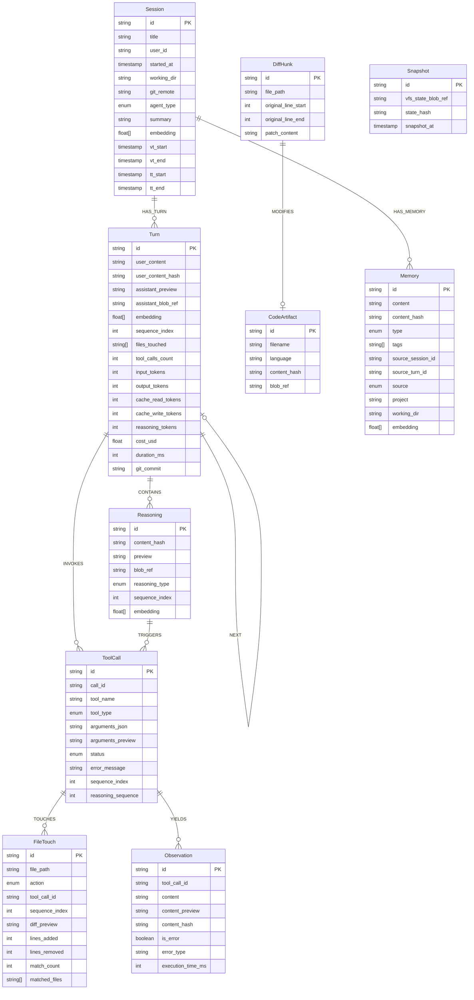

### Node Types

| Node | Purpose | Key Fields |
|:-----|:--------|:-----------|
| **Session** | Container for conversation | working_dir, git_remote, agent_type, summary |
| **Turn** | User prompt + assistant response pair | user_content, assistant_preview, embedding, files_touched |
| **Reasoning** | Thinking/reasoning block | reasoning_type (chain_of_thought, reflection, planning, analysis) |
| **ToolCall** | Tool invocation with lineage | tool_name, tool_type, status, arguments_json |
| **FileTouch** | File operation record | file_path, action (read/edit/create/delete/list/search) |
| **Observation** | Tool execution result | content, is_error, execution_time_ms |
| **Memory** | Explicit long-term memory | type (decision, context, insight, preference, fact, turn) |
| **CodeArtifact** | Code snippets | filename, language, blob_ref |
| **DiffHunk** | Patch content | file_path, patch_content |
| **Snapshot** | VFS state snapshot | vfs_state_blob_ref, snapshot_at |

### Edge Types

| Edge | From → To | Purpose |
|:-----|:----------|:--------|
| **HAS_TURN** | Session → Turn | Session contains turns |
| **NEXT** | Turn → Turn | Sequential ordering |
| **CONTAINS** | Turn → Reasoning | Turn contains thinking blocks |
| **INVOKES** | Turn → ToolCall | Turn triggers tool calls |
| **TRIGGERS** | Reasoning → ToolCall | Causal link: reasoning led to tool call |
| **TOUCHES** | ToolCall → FileTouch | Tool operated on file |
| **YIELDS** | ToolCall → Observation | Tool produced result |
| **MODIFIES** | DiffHunk → CodeArtifact | Diff changes code |
| **REPLACES** | Node → Node | Version supersession |
| **SAME_AS** | Node → Node | Deduplication link |

### Tool Call Types

```typescript
const ToolCallType = {
  // File operations
  FILE_READ, FILE_WRITE, FILE_EDIT, FILE_MULTI_EDIT,
  FILE_GLOB, FILE_GREP, FILE_LIST,

  // Execution
  BASH_EXEC, NOTEBOOK_READ, NOTEBOOK_EDIT,

  // Web
  WEB_FETCH, WEB_SEARCH,

  // Agent
  AGENT_SPAWN, TODO_READ, TODO_WRITE,

  // MCP
  MCP,

  // Fallback
  UNKNOWN,
};
```

## MCP Server Architecture

The Engram MCP Server provides Model Context Protocol integration for AI agents with both stdio and HTTP transports.

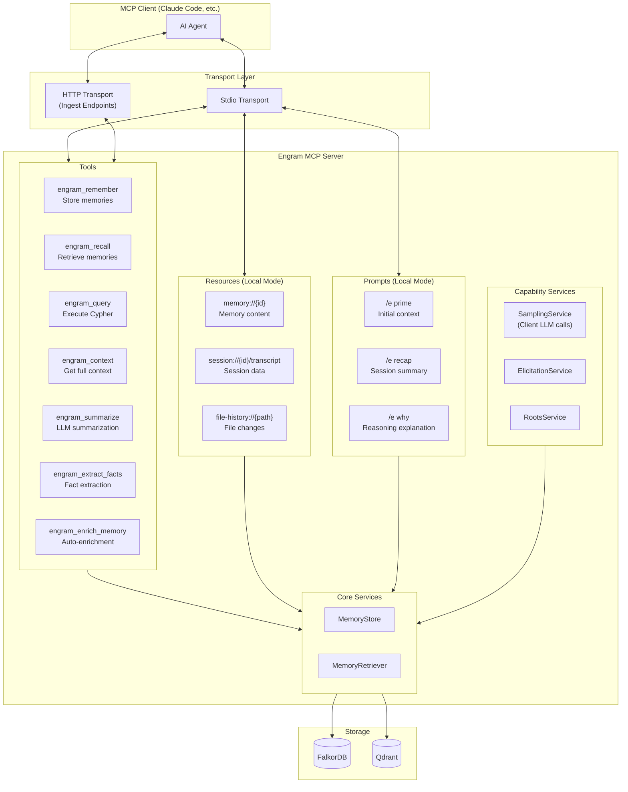

### MCP Tools

| Tool | Purpose | Parameters |
|:-----|:--------|:-----------|
| **engram_remember** | Store memory with deduplication | content, type (decision/context/insight/preference/fact), tags, project |
| **engram_recall** | Hybrid search with optional reranking | query, limit, project, types, rerank |
| **engram_query** | Execute read-only Cypher queries (local mode) | query (Cypher string) |
| **engram_context** | Comprehensive context for task | query, include_sessions, include_memories, include_file_history |
| **engram_summarize** | Summarize text using client LLM | text, max_length (requires sampling capability) |
| **engram_extract_facts** | Extract key facts as structured list | text (requires sampling capability) |
| **engram_enrich_memory** | Auto-generate summary, keywords, category | memory_id (requires sampling capability) |

### MCP Resources (Local Mode Only)

| Resource URI | Content |
|:-------------|:--------|
| `memory://{id}` | Memory node content with metadata |
| `session://{id}/transcript` | Full session transcript with turns |
| `file-history://{path}` | File change history across sessions |

### MCP Prompts (Local Mode Only)

| Prompt | Purpose |
|:-------|:--------|
| **/e prime** | Initial context priming with relevant memories and recent activity |
| **/e recap** | Session summary for context recovery after breaks |
| **/e why** | Explain reasoning behind decisions with causal trace |

## Cloud REST API

The Cloud API (`apps/api`) provides authenticated HTTP access to memory operations with API key authentication and rate limiting.

### API Endpoints

| Endpoint | Method | Purpose | Scope |
|:---------|:-------|:--------|:------|
| `/v1/health` | GET | Health check | Public |
| `/v1/memory/remember` | POST | Store memory with deduplication | `memory:write` |
| `/v1/memory/recall` | POST | Hybrid search with reranking | `memory:read` |
| `/v1/memory/query` | POST | Read-only Cypher queries | `query:read` |
| `/v1/memory/context` | POST | Comprehensive context assembly | `memory:read` |
| `/v1/keys` | GET | List API keys | `keys:manage` |
| `/v1/keys/revoke` | POST | Revoke API key | `keys:manage` |

### Authentication

- API keys stored in PostgreSQL with scoped permissions
- Rate limiting per API key
- CORS configuration for web clients

## Search Service API

The Search Service (`apps/search`) provides vector search capabilities via FastAPI.

### Search Endpoints

| Endpoint | Method | Purpose |
|:---------|:-------|:--------|
| `/health` | GET | Health check with Qdrant status |
| `/ready` | GET | Kubernetes readiness probe |
| `/metrics` | GET | Prometheus metrics |
| `/search` | POST | Hybrid search with strategy (dense/sparse/hybrid) |
| `/search/multi-query` | POST | LLM-driven query expansion (DMQR-RAG) |
| `/search/session-aware` | POST | Two-stage hierarchical retrieval |
| `/embed` | POST | Generate embeddings for external use |

## Embedding Architecture

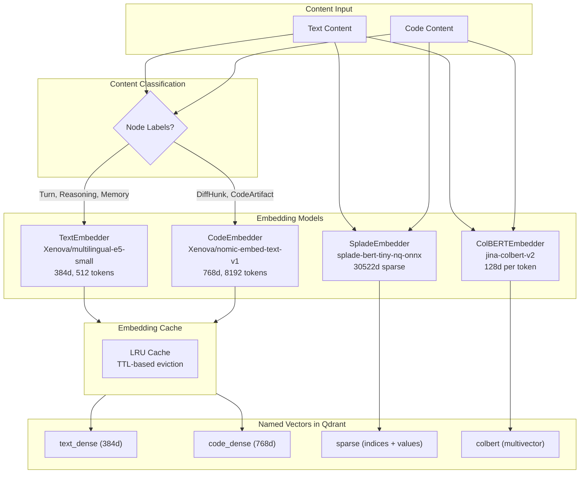

## Search Pipeline

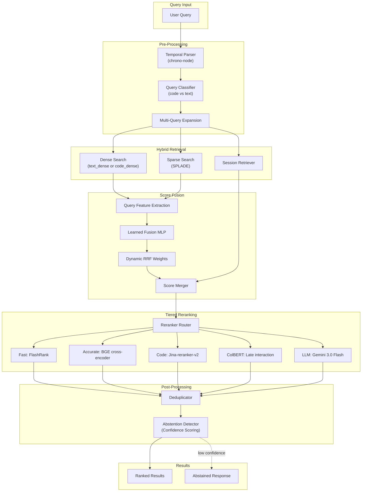

### Search Services

| Service | Purpose |
|:--------|:--------|
| **TemporalParser** | Parse temporal expressions ("yesterday", "last week") |
| **QueryClassifier** | Classify queries as code vs text |
| **MultiQueryRetriever** | Expand queries for better recall |
| **SessionRetriever** | Two-stage session-aware retrieval |
| **SessionSummarizer** | Generate session summaries for indexing |
| **LearnedFusion** | MLP-based dynamic RRF weight prediction |
| **RerankerRouter** | Route to appropriate reranker tier |
| **AbstentionDetector** | Detect when to abstain from answering |
| **Deduplicator** | Remove duplicate results |

### Reranker Tiers

| Tier | Model | Latency | Use Case |
|:-----|:------|:--------|:---------|
| **fast** | FlashRank | ~10ms | High-throughput, real-time autocomplete |
| **accurate** | BGE cross-encoder | ~50ms | General-purpose accuracy |
| **code** | Jina-reranker-v2 | ~50ms | Code-specific ranking |
| **colbert** | Late interaction | ~30ms | Multi-vector token-level matching |
| **llm** | Gemini 3.0 Flash listwise | ~500ms | Highest quality, complex queries |

## Provider Parsers

The ingestion system uses a registry-based parser architecture to support multiple AI agent formats.

```mermaid
flowchart LR
    subgraph Input["Raw Events"]
        ClaudeCode["Claude Code"]
        Anthropic["Anthropic API"]
        OpenAI["OpenAI API"]
        Gemini["Gemini"]
        Codex["Codex"]
        Cline["Cline"]
        XAI["XAI/Grok"]
        OpenCode["OpenCode"]
    end

    subgraph Registry["Parser Registry"]
        Detect["Provider Detection"]
        Lookup["Parser Lookup"]
    end

    subgraph Parsers["Provider Parsers"]
        ClaudeCodeParser["ClaudeCodeParser"]
        AnthropicParser["AnthropicParser"]
        OpenAIParser["OpenAIParser"]
        GeminiParser["GeminiParser"]
        CodexParser["CodexParser"]
        ClineParser["ClineParser"]
        XAIParser["XAIParser"]
        OpenCodeParser["OpenCodeParser"]
    end

    subgraph Extractors["Stream Extractors"]
        ThinkingExtractor["ThinkingExtractor<br/>(<thinking> blocks)"]
        DiffExtractor["DiffExtractor<br/>(Unified diffs)"]
        Redactor["PII Redactor"]
    end

    subgraph Output["Normalized Output"]
        StreamDelta["StreamDelta"]
    end

    Input --> Detect --> Lookup --> Parsers
    Parsers --> ThinkingExtractor --> DiffExtractor --> Redactor --> StreamDelta
```

### Supported Providers

| Provider | Parser | Aliases |
|:---------|:-------|:--------|
| Anthropic | AnthropicParser | claude |
| Claude Code | ClaudeCodeParser | claude-code |
| OpenAI | OpenAIParser | gpt, gpt-4, gpt-3.5 |
| Gemini | GeminiParser | - |
| Codex | CodexParser | - |
| Cline | ClineParser | - |
| XAI | XAIParser | grok, grok-3 |
| OpenCode | OpenCodeParser | - |

## Kafka Topic Flow

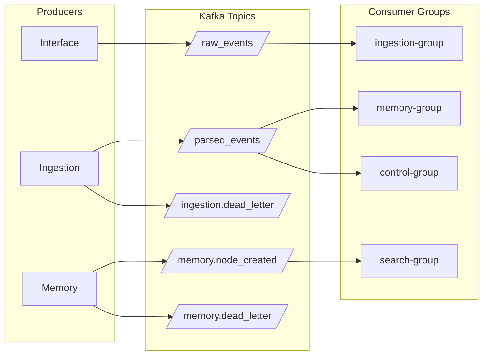

## Service Communication Matrix

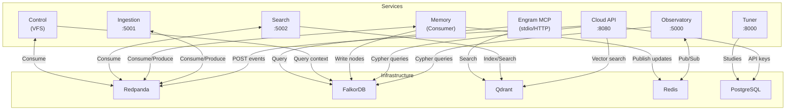

## Infrastructure

### Development Stack (docker-compose.dev.yml)

| Service | Image | Ports | Purpose |
|:--------|:------|:------|:--------|
| **Redpanda** | redpanda:v24.2.1 | 9092, 19092, 18081 | Kafka-compatible streaming |
| **FalkorDB** | falkordb:v4.2.1 | 6379 | Graph database |
| **Qdrant** | qdrant:v1.12.1 | 6333, 6334 | Vector database (HTTP + gRPC) |
| **PostgreSQL** | postgres:17-alpine | 5432 | API keys & Optuna persistence |
| **Tuner** | Custom (FastAPI) | 8000 | Hyperparameter optimization |
| **Optuna Dashboard** | optuna-dashboard:v0.17.0 | 8080 | Optimization visualization |

### Production Infrastructure (Pulumi/GCP)

All infrastructure managed via Pulumi IaC (`packages/infra`) with cost control via `devEnabled` flag.

**Networking:**
- VPC network with private Google access
- Cloud Router with NAT gateway for egress
- Regional subnet with manual configuration

**GKE Autopilot Cluster:**
- Fully-managed node provisioning and scaling
- Vertical Pod Autoscaling enabled
- Regular release channel for automatic upgrades
- Deletion protection in production

**Kubernetes Workloads (engram namespace):**

| Component | Type | Storage | Replicas (dev/prod) |
|:----------|:-----|:--------|:--------------------|
| FalkorDB | StatefulSet | 50Gi PVC | 1 / 3 |
| Qdrant | Helm Chart | 50Gi PVC | 1 / 3 |
| Redpanda | Helm Chart | 50Gi PVC | 1 / 3 |
| PostgreSQL | StatefulSet | 10Gi PVC | 1 / 1 |
| Tuner API | Deployment | - | 2 / 2 |
| Dashboard | Deployment | - | 1 / 1 |

**Network Policies (Least Privilege):**
- Default deny-all ingress for namespace
- FalkorDB: memory, ingestion, mcp, backup jobs only
- Qdrant: search, memory, backup jobs only
- Redpanda: ingestion, memory, backup jobs only

**RBAC Service Accounts:**
- `memory-sa`, `ingestion-sa`, `search-sa`, `mcp-sa`: ConfigMaps, Secrets, Pods access
- `backup-sa`: ClusterRole for PVC and storage access

**Automated Backups:**
- GCS bucket with 30-day retention
- Daily CronJobs: FalkorDB (2 AM), Qdrant (3 AM), Redpanda (4 AM)
- Stored in `gs://{project}-engram-backups/`

**Secret Management:**
- Google Generative AI API key for Gemini reranking
- PostgreSQL credentials for tuner service
- Automatic replication across regions

## Hyperparameter Tuning

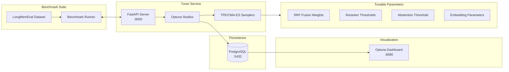

## Benchmark Evaluation

The benchmark package provides LongMemEval evaluation for measuring retrieval quality.

### Supported Abilities

| Ability | Description |
|:--------|:------------|
| **Information Extraction** | Extract specific facts from memory |
| **Multi-Session Reasoning** | Reason across multiple sessions |
| **Temporal Reasoning** | Answer time-based queries |
| **Knowledge Update** | Handle conflicting/updated information |
| **Abstention** | Know when not to answer |

### Benchmark CLI

```bash
# Run full evaluation
engram-benchmark run --abilities all --judge anthropic

# Run specific ability
engram-benchmark run --abilities temporal_reasoning

# Train fusion weights
engram-benchmark train-fusion --study-name fusion-v1

# Validate dataset
engram-benchmark validate
```

## Bitemporal Model

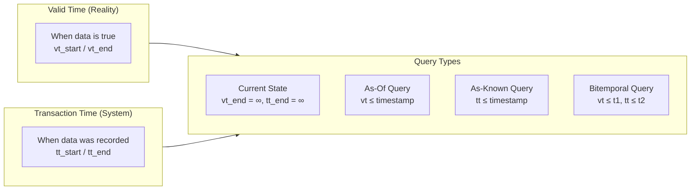

All graph nodes and edges carry four timestamps:
- `vt_start`: When the fact became true
- `vt_end`: When the fact stopped being true (∞ if current)
- `tt_start`: When we recorded this fact
- `tt_end`: When we updated/deleted this record (∞ if current)

This enables time-travel queries like "What did we know about session X at time T?"

## Time Travel & VFS

The Control Service provides filesystem reconstruction at any point in time via the integrated ExecutionService.

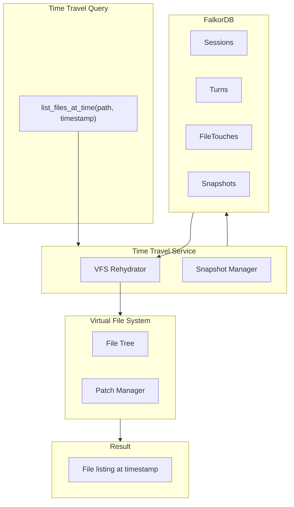

### VFS & Time-Travel Operations (Control Service)

| Operation | Purpose |
|:----------|:--------|
| **readFile** | Read file from VFS |
| **applyPatch** | Apply unified diff to VFS |
| **listFilesAtTime** | Get filesystem state at timestamp |
| **getFilesystemState** | Get full VFS at a point in time |
| **getZippedState** | Get zipped snapshot of VFS |

## Package Structure

```
engram/
├── apps/
│   ├── api/              # Cloud REST API (Hono) - API key auth, rate limiting (:8080)
│   ├── control/          # Session orchestration, XState decision engine, VFS
│   ├── ingestion/        # Event parsing pipeline, 8+ provider parsers (:5001)
│   ├── mcp/              # Engram MCP server (stdio + HTTP ingest)
│   ├── memory/           # Graph persistence, turn aggregation (Kafka consumer)
│   ├── observatory/      # Neural Observatory - Next.js 16 session visualization (:5000)
│   ├── search/           # Python/FastAPI vector search, hybrid retrieval (:5002)
│   └── tuner/            # Python/FastAPI hyperparameter optimization (:8000)
│
├── packages/
│   ├── benchmark/        # LongMemEval evaluation suite (Python)
│   ├── common/           # Utilities, errors, constants, testing fixtures
│   ├── events/           # Zod event schemas (RawStreamEvent, ParsedStreamEvent)
│   ├── graph/            # Bitemporal graph models, repositories, QueryBuilder
│   ├── infra/            # Pulumi IaC for GCP (VPC, GKE Autopilot, databases)
│   ├── logger/           # Pino structured logging with PII redaction
│   ├── parser/           # Provider stream parsers, ThinkingExtractor, Redactor
│   ├── storage/          # FalkorDB, Kafka, PostgreSQL, Redis, GCS clients
│   ├── temporal/         # Rehydrator, TimeTravelService, ReplayEngine
│   ├── tsconfig/         # Shared TypeScript 7 (tsgo) configuration
│   ├── tuner/            # TypeScript client, CLI, trial executor
│   └── vfs/              # VirtualFileSystem, NodeFileSystem, PatchManager
│
└── ARCHITECTURE.md       # This document
```
