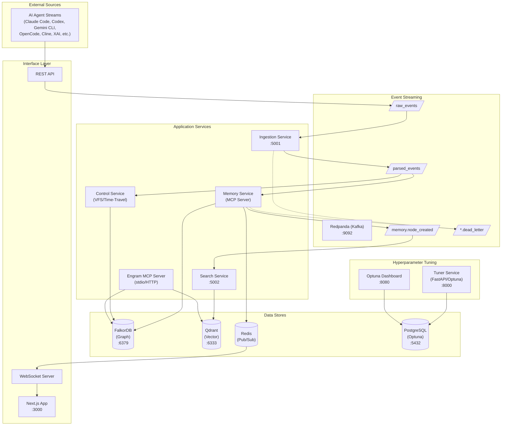
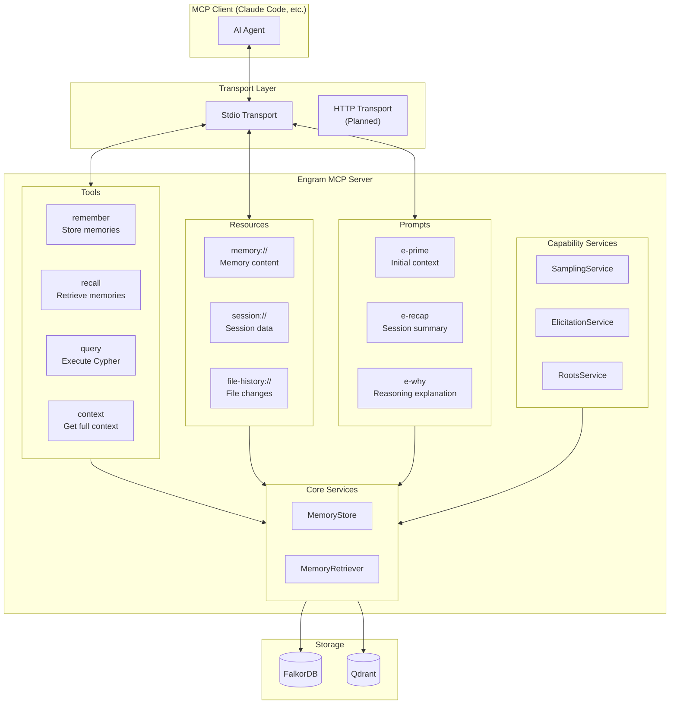
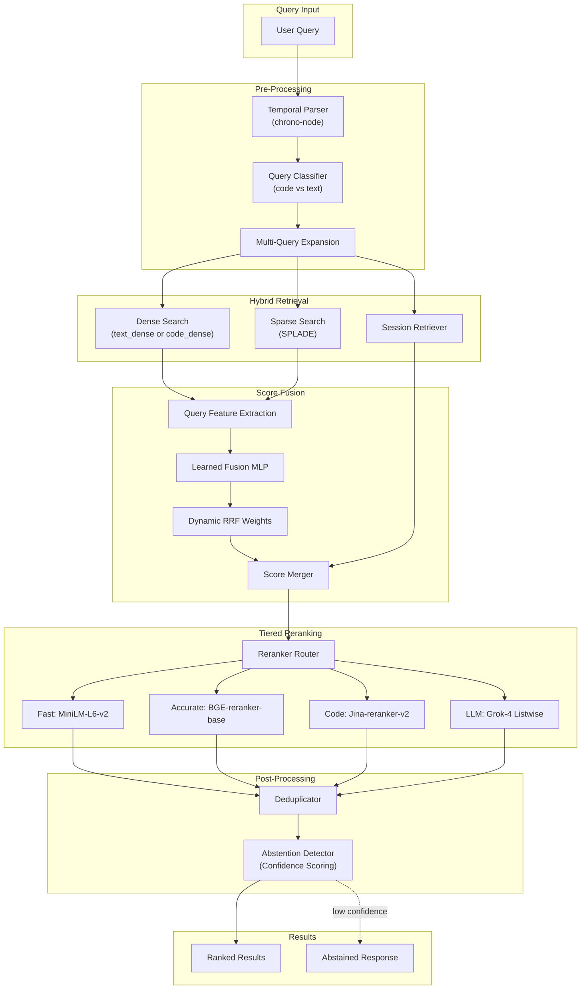
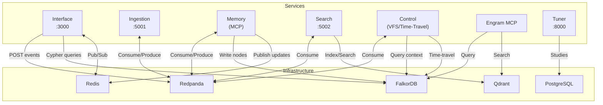

# Engram Architecture

A bitemporal, graph-backed intelligent agent memory system.

## System Overview



## Data Flow Pipeline


## Graph Data Model


### Node Types

| Node | Purpose | Key Fields |
|:-----|:--------|:-----------|
| **Session** | Container for conversation | working_dir, git_remote, agent_type, summary |
| **Turn** | User prompt + assistant response pair | user_content, assistant_preview, embedding, files_touched |
| **Reasoning** | Thinking/reasoning block | reasoning_type (chain_of_thought, reflection, planning, analysis) |
| **ToolCall** | Tool invocation with lineage | tool_name, tool_type, status, arguments_json |
| **FileTouch** | File operation record | file_path, action (read/edit/create/delete/list/search) |
| **Observation** | Tool execution result | content, is_error, execution_time_ms |
| **Memory** | Explicit long-term memory | type (decision, context, insight, preference, fact, turn) |
| **CodeArtifact** | Code snippets | filename, language, blob_ref |
| **DiffHunk** | Patch content | file_path, patch_content |
| **Snapshot** | VFS state snapshot | vfs_state_blob_ref, snapshot_at |

### Edge Types

| Edge | From → To | Purpose |
|:-----|:----------|:--------|
| **HAS_TURN** | Session → Turn | Session contains turns |
| **NEXT** | Turn → Turn | Sequential ordering |
| **CONTAINS** | Turn → Reasoning | Turn contains thinking blocks |
| **INVOKES** | Turn → ToolCall | Turn triggers tool calls |
| **TRIGGERS** | Reasoning → ToolCall | Causal link: reasoning led to tool call |
| **TOUCHES** | ToolCall → FileTouch | Tool operated on file |
| **YIELDS** | ToolCall → Observation | Tool produced result |
| **MODIFIES** | DiffHunk → CodeArtifact | Diff changes code |
| **REPLACES** | Node → Node | Version supersession |
| **SAME_AS** | Node → Node | Deduplication link |

### Tool Call Types

```typescript
const ToolCallType = {
  // File operations
  FILE_READ, FILE_WRITE, FILE_EDIT, FILE_MULTI_EDIT,
  FILE_GLOB, FILE_GREP, FILE_LIST,

  // Execution
  BASH_EXEC, NOTEBOOK_READ, NOTEBOOK_EDIT,

  // Web
  WEB_FETCH, WEB_SEARCH,

  // Agent
  AGENT_SPAWN, TODO_READ, TODO_WRITE,

  // MCP
  MCP,

  // Fallback
  UNKNOWN,
};
```

## MCP Server Architecture

The Engram MCP Server provides Model Context Protocol integration for AI agents.



### MCP Tools

| Tool | Purpose | Parameters |
|:-----|:--------|:-----------|
| **remember** | Store context for future retrieval | content, type, tags, project |
| **recall** | Retrieve relevant memories | query, limit, project, types |
| **query** | Execute raw Cypher queries | query (Cypher string) |
| **context** | Get comprehensive context | query, include_sessions, include_memories |

### MCP Resources

| Resource URI | Content |
|:-------------|:--------|
| `memory://{id}` | Memory node content |
| `session://{id}` | Session with turns |
| `file-history://{path}` | File change history |

### MCP Prompts

| Prompt | Purpose |
|:-------|:--------|
| **e-prime** | Initial context priming with relevant memories |
| **e-recap** | Session summary for context recovery |
| **e-why** | Explain reasoning behind decisions |

## Embedding Architecture


## Search Pipeline



### Search Services

| Service | Purpose |
|:--------|:--------|
| **TemporalParser** | Parse temporal expressions ("yesterday", "last week") |
| **QueryClassifier** | Classify queries as code vs text |
| **MultiQueryRetriever** | Expand queries for better recall |
| **SessionRetriever** | Two-stage session-aware retrieval |
| **SessionSummarizer** | Generate session summaries for indexing |
| **LearnedFusion** | MLP-based dynamic RRF weight prediction |
| **RerankerRouter** | Route to appropriate reranker tier |
| **AbstentionDetector** | Detect when to abstain from answering |
| **Deduplicator** | Remove duplicate results |

### Reranker Tiers

| Tier | Model | Use Case |
|:-----|:------|:---------|
| **fast** | MiniLM-L-6-v2 | High-throughput, low-latency |
| **accurate** | BGE-reranker-base | General-purpose accuracy |
| **code** | Jina-reranker-v2 | Code-specific ranking |
| **llm** | Grok-4 Listwise | Highest quality, complex queries |

## Provider Parsers

The ingestion system uses a registry-based parser architecture to support multiple AI agent formats.


### Supported Providers

| Provider | Parser | Aliases |
|:---------|:-------|:--------|
| Anthropic | AnthropicParser | claude |
| Claude Code | ClaudeCodeParser | claude-code |
| OpenAI | OpenAIParser | gpt, gpt-4, gpt-3.5 |
| Gemini | GeminiParser | - |
| Codex | CodexParser | - |
| Cline | ClineParser | - |
| XAI | XAIParser | grok, grok-3 |
| OpenCode | OpenCodeParser | - |

## Kafka Topic Flow


## Service Communication Matrix



## Infrastructure

### Development Stack (docker-compose.dev.yml)

| Service | Image | Ports | Purpose |
|:--------|:------|:------|:--------|
| **Redpanda** | redpanda:v23.3.1 | 9092, 19092, 18081 | Kafka-compatible streaming |
| **FalkorDB** | falkordb:latest | 6379 | Graph database |
| **Qdrant** | qdrant:latest | 6333 | Vector database |
| **PostgreSQL** | postgres:17-alpine | 5432 | Optuna study persistence |
| **Tuner** | Custom (FastAPI) | 8000 | Hyperparameter optimization |
| **Optuna Dashboard** | optuna-dashboard | 8080 | Optimization visualization |

### Production Infrastructure (Pulumi/GCP)

- **GKE Cluster**: Kubernetes for service orchestration
- **Cloud Run**: Serverless service deployments
- **Cloud Storage**: Blob storage for large content
- **Managed Redis**: Real-time pub/sub

## Hyperparameter Tuning


## Benchmark Evaluation

The benchmark package provides LongMemEval evaluation for measuring retrieval quality.

### Supported Abilities

| Ability | Description |
|:--------|:------------|
| **Information Extraction** | Extract specific facts from memory |
| **Multi-Session Reasoning** | Reason across multiple sessions |
| **Temporal Reasoning** | Answer time-based queries |
| **Knowledge Update** | Handle conflicting/updated information |
| **Abstention** | Know when not to answer |

### Benchmark CLI

```bash
# Run full evaluation
engram-benchmark run --abilities all --judge anthropic

# Run specific ability
engram-benchmark run --abilities temporal_reasoning

# Train fusion weights
engram-benchmark train-fusion --study-name fusion-v1

# Validate dataset
engram-benchmark validate
```

## Bitemporal Model


All graph nodes and edges carry four timestamps:
- `vt_start`: When the fact became true
- `vt_end`: When the fact stopped being true (∞ if current)
- `tt_start`: When we recorded this fact
- `tt_end`: When we updated/deleted this record (∞ if current)

This enables time-travel queries like "What did we know about session X at time T?"

## Time Travel & VFS

The Control Service provides filesystem reconstruction at any point in time via the integrated ExecutionService.


### VFS & Time-Travel Operations (Control Service)

| Operation | Purpose |
|:----------|:--------|
| **readFile** | Read file from VFS |
| **applyPatch** | Apply unified diff to VFS |
| **listFilesAtTime** | Get filesystem state at timestamp |
| **getFilesystemState** | Get full VFS at a point in time |
| **getZippedState** | Get zipped snapshot of VFS |

## Package Structure

```
the-system/
├── apps/
│   ├── control/          # Orchestration, VFS & time-travel
│   ├── ingestion/        # Event stream processing
│   ├── interface/        # Next.js frontend
│   ├── mcp/              # Engram MCP server
│   ├── memory/           # Graph persistence service
│   ├── search/           # Vector search service
│   └── tuner/            # Python/FastAPI hyperparameter tuning
│
├── packages/
│   ├── benchmark/        # LongMemEval evaluation suite
│   ├── common/           # Shared utilities
│   ├── events/           # Event schemas
│   ├── graph/            # Graph models & repositories
│   ├── infra/            # Pulumi infrastructure
│   ├── logger/           # Pino-based logging
│   ├── parser/           # Provider stream parsers
│   ├── search/           # Search services & embedders
│   ├── storage/          # Falkor, Kafka, Redis clients
│   ├── temporal/         # Time-travel service
│   ├── tsconfig/         # Shared TypeScript config
│   ├── tuner/            # Tuner client package
│   └── vfs/              # Virtual file system
│
└── ARCHITECTURE.md       # This document
```
