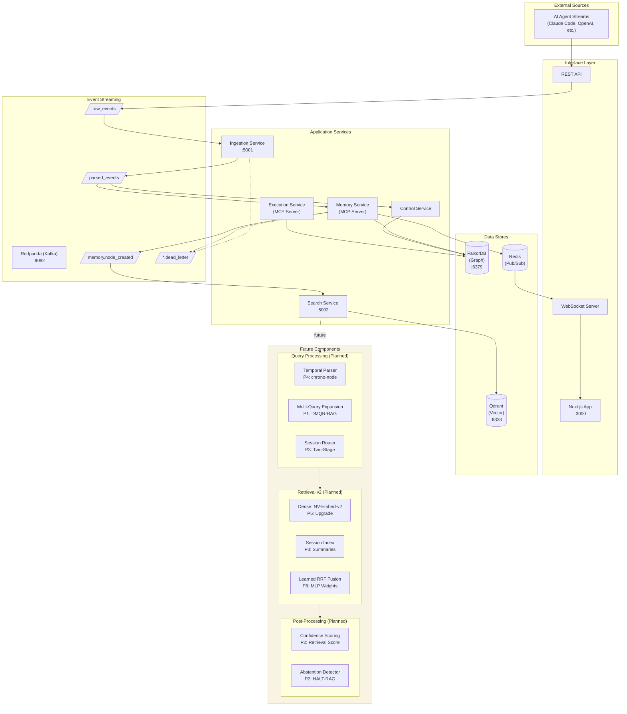
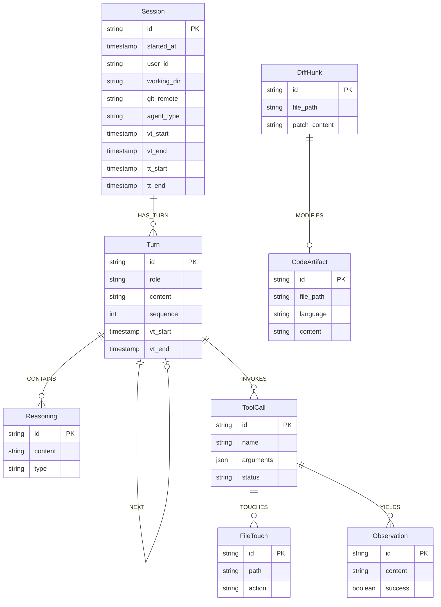
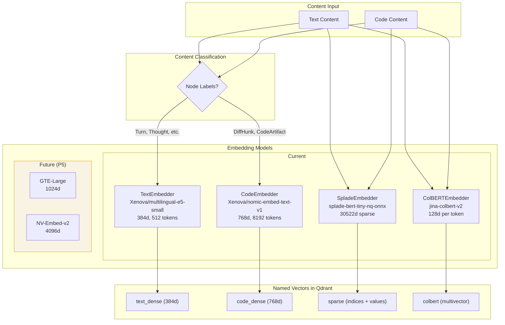
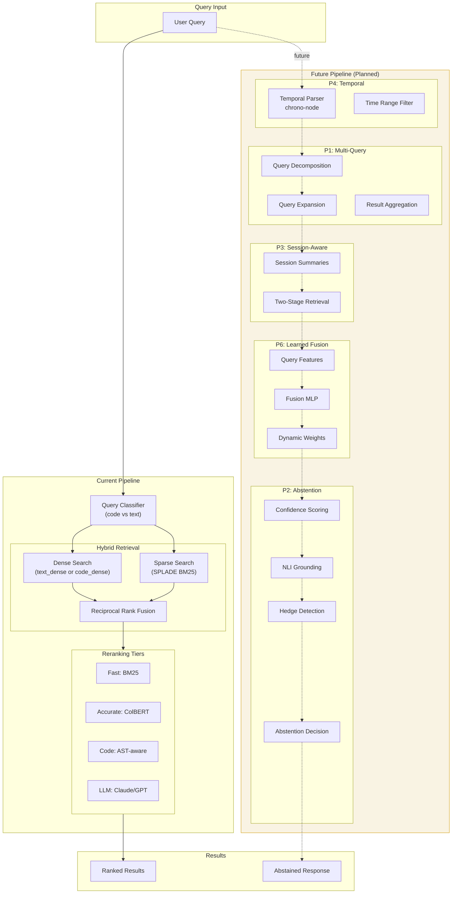
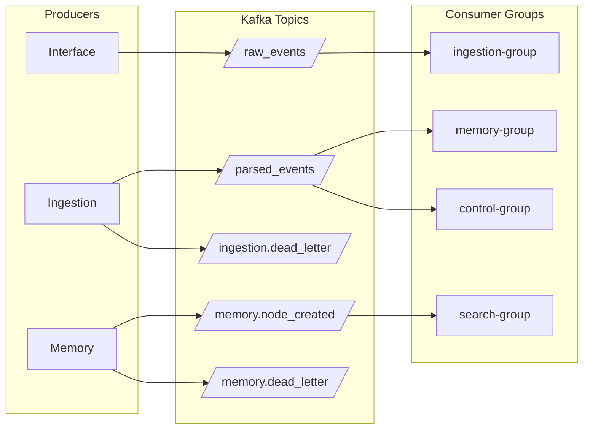
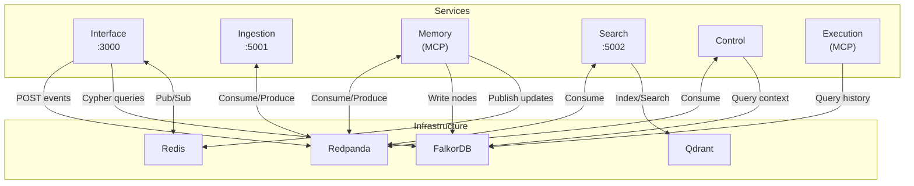
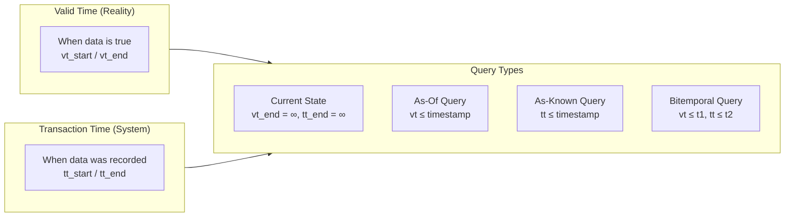

# Engram Architecture

A bitemporal, graph-backed intelligent agent memory system.

## System Overview

## Data Flow Pipeline

```mermaid
flowchart LR
    subgraph Capture["1. Capture"]
        Stream["Agent Stream"]
        Raw["Raw Event"]
    end

    subgraph Parse["2. Parse"]
        Provider["Provider Detection"]
        Extract["Content Extraction"]
        Redact["PII Redaction"]
    end

    subgraph Store["3. Store"]
        Aggregate["Turn Aggregation"]
        Graph["Graph Persistence"]
        Temporal["Bitemporal Tracking"]
    end

    subgraph Index["4. Index"]
        Classify["Type Classification"]
        Embed["Embedding Generation"]
        Vector["Vector Storage"]
    end

    subgraph Retrieve["5. Retrieve"]
        Hybrid["Hybrid Search"]
        Rerank["Reranking"]
        Return["Results"]
    end

    Stream --> Raw --> Provider --> Extract --> Redact
    Redact --> Aggregate --> Graph --> Temporal
    Temporal --> Classify --> Embed --> Vector
    Vector --> Hybrid --> Rerank --> Return
```

## Graph Data Model

## Embedding Architecture

## Search Pipeline

## Kafka Topic Flow

## Service Communication Matrix

## Future Roadmap

```mermaid
gantt
    title Retrieval v2 Implementation Phases
    dateFormat X
    axisFormat %s

    section Phase 1 - Quick Wins
    P2 Abstention Detection     :p2, 0, 1
    P4 Temporal Query Parser    :p4, 0, 1
    P5 Embedding Upgrade        :p5, 0, 1

    section Phase 2 - Core
    P1 Multi-Query Retrieval    :p1, 1, 2
    P3 Session-Aware Retrieval  :p3, 1, 2

    section Phase 3 - Optimization
    P6 Learned Fusion           :p6, 2, 3
```

| Priority | Feature | Expected Gain | Status |
|:--------:|:--------|:-------------:|:------:|
| P1 | Multi-Query Retrieval (DMQR-RAG) | +5-8% | Planned |
| P2 | Abstention Detection (HALT-RAG) | +3-5% | Planned |
| P3 | Session-Aware Retrieval | +2-4% | Planned |
| P4 | Temporal Query Understanding | +3-5% | Planned |
| P5 | Embedding Model Upgrade (GTE/NV-Embed) | +2-3% | Planned |
| P6 | Learned Fusion (MLP weights) | +1-2% | Planned |

**Current LongMemEval Accuracy**: 75.8%
**Target**: 85-88% (SOTA: 86%)

## Bitemporal Model

All graph nodes and edges carry four timestamps:
- `vt_start`: When the fact became true
- `vt_end`: When the fact stopped being true (∞ if current)
- `tt_start`: When we recorded this fact
- `tt_end`: When we updated/deleted this record (∞ if current)

This enables time-travel queries like "What did we know about session X at time T?"
