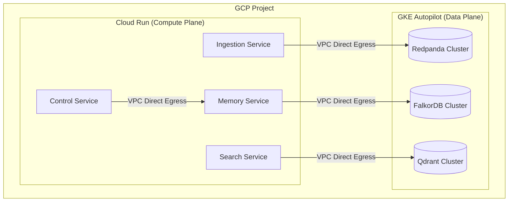

# Bead: Define Cloud Infrastructure Strategy (GCP)

## Context
The system must run strictly on **Google Cloud Platform (GCP)**. We have a requirement to use **Cloud Run** for containers, but we also rely on heavy stateful services (Redpanda, FalkorDB, Qdrant) which are ill-suited for stateless Cloud Run environments.

## Goal
Define a hybrid architecture within GCP that leverages **Cloud Run** for application logic and **GKE Autopilot** (or Standard GKE) for the persistent data layer, ensuring a robust, scalable, and "GCP-native" deployment.

## Research & Rationale
-   **Cloud Run**: Ideal for the "Context" services (Ingestion, Memory, Search API). It handles scaling to zero, HTTPS termination, and revision management automatically.
-   **GKE (Google Kubernetes Engine)**: The only viable GCP-native way to self-host complex stateful workloads like Redpanda and Redis-compatible modules (FalkorDB) if managed versions aren't used.
    -   *Decision*: Use **GKE Autopilot** for the "Data Plane". It creates a hands-off Kubernetes experience while supporting StatefulSets and Persistent Volumes (PVCs) required by our DBs.
-   **Networking**: A **Shared VPC** or simple VPC Peering will connect the Cloud Run services (via Serverless VPC Access Connector or Direct VPC Egress) to the GKE cluster IPs.

## Architecture Diagram

## Implementation Plan
1.  **VPC**: Create a `soul-network` VPC.
2.  **GKE**: Provision `soul-data-cluster` (Autopilot mode) in `soul-network`.
3.  **Cloud Run**: Configure "Direct VPC Egress" to `soul-network` for all services.
4.  **Service Discovery**: Use internal K8s DNS or Internal Load Balancers (ILB) to expose Redpanda/Falkor/Qdrant to Cloud Run.

## Acceptance Criteria
-   [ ] Architecture diagram approved.
-   [ ] Terraform plan exists for VPC, GKE Autopilot, and Cloud Run setup.
-   [ ] Documentation explains how Cloud Run services resolve internal GKE service IPs.
