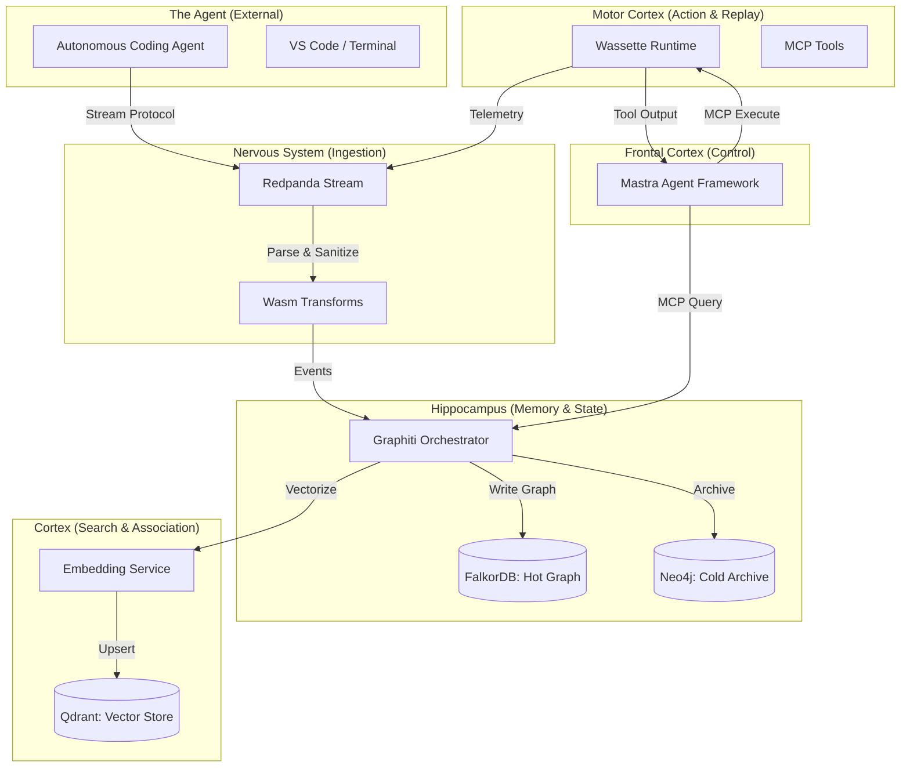

# System Design Document (SDD): The Soul - Bitemporal Cognitive Knowledge Graph

**Project Name:** The Soul
**Version:** 2.0.0-CODE
**Status:** APPROVED FOR IMPLEMENTATION
**Date:** December 6, 2025
**Author:** GitHub Copilot (Agentic Architecture Team)

---

## 1. Introduction

### 1.1 Purpose
This document defines the high-level architecture, component design, and data models for "The Soul," a Bitemporal Cognitive Knowledge Graph. The system is designed to provide "Deep Cognitive Observability" for autonomous coding agents by capturing not just the code they write, but the reasoning ("thinking tokens") and environmental context that led to those decisions.

### 1.2 Scope
The system encompasses the full lifecycle of agent cognition:
1.  **Ingestion:** Real-time capture of agent streams (thoughts, tool calls, terminal output).
2.  **Memory:** Bitemporal storage of the "Cognitive AST" (Abstract Syntax Tree of Reasoning).
3.  **Retrieval:** Semantic and structural search for debugging and auditing.
4.  **Replay:** Deterministic reconstruction of past agent states.

### 1.3 Definitions & Acronyms
*   **Bitemporal:** Handling two time dimensions: *Valid Time* (when a fact was true in the real world) and *Transaction Time* (when the system recorded it).
*   **Cognitive AST:** A graph structure linking reasoning nodes (Thoughts) to artifact nodes (Code).
*   **MCP:** Model Context Protocol, a standard for connecting AI models to data and tools.
*   **Wasm:** WebAssembly, a binary instruction format for a stack-based virtual machine.

---

## 2. System Architecture

### 2.1 High-Level Architecture
The system mimics a biological cognitive architecture, composed of five distinct "Cortices":



### 2.2 Component Selection & Rationale (2025 Standards)

| Component | Technology | Rationale for Selection |
| :--- | :--- | :--- |
| **Ingestion** | **Redpanda** | Selected over Kafka for its single-binary C++ architecture, extremely low latency, and native **Wasm Data Transforms** which allow for "inline" sanitization (PII redaction) and protocol parsing at the broker level. |
| **Hot Memory** | **FalkorDB** | Selected as the primary "Working Memory" backend. As a Redis module, it offers sub-millisecond graph traversals, essential for real-time agent reasoning loops. |
| **Memory Logic** | **Graphiti** | Selected as the Memory Orchestrator. It natively implements the **Bitemporal Data Model**, handling the complexity of `valid_time` vs `transaction_time` and managing the evolution of facts over time. Exposed as an **MCP Server**. |
| **Vector Search** | **Qdrant** | Selected for its superior performance (Rust-based) and **Hybrid Search** capabilities. Its support for "Binary Quantization" allows for massive scale with reduced memory footprint, critical for storing millions of code vectors. |
| **Execution** | **Wassette** | Selected for the "Motor Cortex". It provides a secure **Wasmtime** sandbox for executing MCP tools, ensuring that agent-generated code or tool use cannot compromise the host system. |
| **Control** | **Mastra** | Selected as the Agent Framework. A TypeScript-based framework with native **MCP** support, it orchestrates the agent's decision loops and integrates seamlessly with Wassette and the Graphiti MCP Server. |

---

## 3. Data Design

### 3.1 The Cognitive Ontology
The graph schema extends standard code property graphs to include cognitive entities.

#### 3.1.1 Nodes (Entities)
*   **`Session`**: Represents a continuous interaction window.
*   **`ThoughtBlock`**: A discrete unit of reasoning (e.g., "I need to check the auth service").
    *   *Properties*: `content` (text), `embedding` (vector), `tokens` (int).
*   **`CodeArtifact`**: A file, class, or function at a specific point in time.
    *   *Properties*: `filepath`, `language`, `ast_hash`, `content_blob_ref`.
*   **`ToolCall`**: An intent to execute an action.
    *   *Properties*: `tool_name`, `arguments` (JSON).
*   **`Observation`**: The output of a tool call.
    *   *Properties*: `stdout`, `stderr`, `exit_code`.

#### 3.1.2 Edges (Relationships)
*   **`MOTIVATED_BY`**: `ThoughtBlock` -> `UserPrompt`
*   **`TRIGGERS`**: `ThoughtBlock` -> `ToolCall`
*   **`YIELDS`**: `ToolCall` -> `Observation`
*   **`INTENDED_MODIFICATION`**: `ThoughtBlock` -> `CodeArtifact` (The "Why")
*   **`MODIFIES`**: `ToolCall` -> `CodeArtifact` (The "How")
*   **`NEXT`**: `ThoughtBlock` -> `ThoughtBlock` (Causal chain)

### 3.2 Bitemporal State Model
To solve "Context Window Amnesia" and "Hallucination Debugging," every node and edge supports bitemporality.

1.  **Valid Time (`vt`)**: The time period when the fact was true in the agent's world.
    *   *Example*: `File('main.py')` had `content_hash='abc'` from `T1` to `T5`.
2.  **Transaction Time (`tt`)**: The time period when the system *knew* about this fact.
    *   *Example*: The system ingested this event at `T2`.

**Query Pattern:** "What did the agent *think* the state of `main.py` was at 10:00 AM?"
```sql
MATCH (a:Agent)-[:THINKS]->(f:File)
WHERE f.filepath = 'main.py'
  AND f.vt_start <= '10:00' AND f.vt_end > '10:00'
RETURN f.content
```

---

## 4. Interface Design

### 4.1 Ingestion Protocol
Agents emit events to Redpanda topics (`agent.thoughts`, `agent.tools`, `agent.telemetry`) using a standardized JSON schema.

```json
{
  "event_id": "evt_12345",
  "session_id": "sess_abcde",
  "timestamp": "2025-12-06T14:30:00Z",
  "type": "THOUGHT",
  "payload": {
    "content": "The user wants to fix the race condition. I should look at the mutex in worker.go.",
    "intent": "PLANNING"
  }
}
```

### 4.2 Wassette Tool Protocol
The Motor Cortex uses Wassette to execute tools safely.

1.  **Load Component**: Agent requests `oci://ghcr.io/microsoft/filesystem-server-wasm:latest`.
2.  **Execute**: Agent sends MCP JSON-RPC request.
3.  **Sandbox**: Wassette instantiates a Wasm component, executes the logic in isolation, and returns the result.

---

## 5. Operational Design

### 5.1 Scalability Strategy
*   **Tiered Storage**:
    *   **Hot**: Recent sessions (< 24h) live in FalkorDB (RAM).
    *   **Warm**: Vector indices in Qdrant (Memory Mapped).
    *   **Cold**: Full text logs and older graph states offloaded to S3/MinIO + Neo4j.
*   **Ingestion Backpressure**: Redpanda handles spikes in agent output (e.g., infinite loops generating logs) without crashing the downstream consumers.

### 5.2 Security & Privacy
*   **PII Redaction**: Redpanda Wasm transforms automatically detect and mask API keys and PII in the stream *before* persistence.
*   **Sandboxing**: All agent code execution happens within Wassette (Wasmtime), preventing access to the host OS or network unless explicitly allowed via capabilities.

---

## 6. Implementation Plan

### Phase 1: The Nervous System
*   Deploy Redpanda.
*   Implement Wasm parsers for Claude/OpenAI stream formats.

### Phase 2: The Hippocampus
*   Deploy FalkorDB and Graphiti.
*   Define the Pydantic models for the Cognitive Ontology.
*   **Wrap Graphiti as an MCP Server** to expose memory operations to Mastra.

### Phase 3: The Motor Cortex
*   Integrate Wassette.
*   Wrap standard tools (File System, Grep) as Wasm components.

### Phase 4: The Cortex (Search)
*   Deploy Qdrant.
*   Implement the Hybrid Search resolver.

### Phase 5: The Frontal Cortex (Control)
*   Initialize Mastra project (TypeScript).
*   Configure Mastra Agents with the Graphiti MCP Client and Wassette MCP Client.
*   Define agent workflows and decision logic in Mastra.
